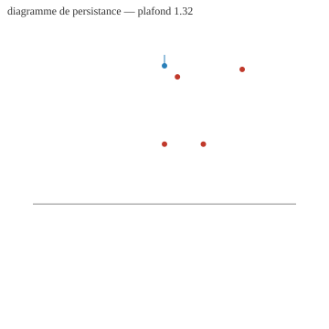
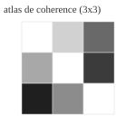

<div align="center">


# RATISS-LABS-GTT
### Geological Topological Tech — le vaisseau amiral de RATISS Labs


    


*Un dépôt. Neuf couches. Une seule loi : **R7** — aucune valeur publiée
sans qu'un étranger puisse la rejouer en une commande.*

**EN :** *One repository, nine layers, one law (R7: every published number
replays in one command). GTT measures the physical coherence of learned
world models, reduces violations downstream without ever touching the
model, and publishes the delta — whatever it is. Built by a two-person
lab in Yaoundé: one human chief, agents under a red/blue protocol.*

</div>

---

## 🔭 Vision

Les modèles du monde appris (famille JEPA, modèles latents) ne respectent
pas nativement les invariants physiques. GTT outille ce problème :
**mesurer** la violation, la **réduire en aval** (correction sans
fine-tuning, verdict APPROVED exigé), **publier le delta** — quel qu'il
soit. « Corriger définitivement » est une vision, jamais une affirmation :
ici, chaque chiffre a un reçu, et chaque reçu se rejoue.

## 📊 Preuves en un coup d'œil (2026-09-13)

| Mesure | Valeur | Reçu |
|---|---|---|
| Suite de tests | **108 passed** (stdlib seule) | CI `gtt.yml` |
| Juge mécanique couche 1 | **exit 0** (SEALS intacts) | CI job `judge` |
| Checks déterministes | **5/5 CONFORME** (wm, quantum, forecast, agents, examples) | `scripts/*_check.py` |
| **Run externe réel LeWM/TwoRooms** — violation ouverte | **0.840789108872** | `proofs/WM-EXTERNE-LEWM-*.md` |
| … corrigée en aval (modèle intact) | **0.214657575488** | idem |
| **Delta d'ablation publié** | **0.626131533384 — APPROVED** | idem |
| Ablation phase 4 (substitut synthétique) | 0.104622125411 → ≈3.33e-16 | `proofs/PHASE4-REPLAY*.md` |
| Scellés R6 | 5 MANIFESTS 0.2.0 figés **avant** tout code (`9990d7e`) | `SEALS.json` |
| Auditeur indépendant | ⏳ **EN ATTENTE** — kit 1 commande | `docs/AUDIT-INDEPENDANT-KIT.md` |

## 🏗️ Architecture — neuf couches jugées une à une


| Couche | Rôle | Statut |
|---|---|---|
| `gtt/core` | topologie, thermodynamique, invariants, hypothèse LCT | implémentée (P2) |
| `gtt/quantum` | Lanczos, MPS/DMRG, décohérence T1/T2, connecteur QPU dry-run | implémentée (P3) |
| `gtt/world_models` | pont LEWM, audit de cohérence, correction aval, ablation | implémentée (P4) + **run externe réel** |
| `gtt/forecast` | calibration Brier/ECE, prédictions scellées R5, journal chaîné, bot Metaculus **désarmé** | implémentée (P5) |
| `gtt/agents` | orchestrateur sans autorité, wrappers rouge/bleu, protocole 1.0 | implémentée (P6) |
| `gtt/receipts` | hash rejouable, vérification ; **Lean proof EN ATTENTE** (run IBM M2) | implémentée (P6) |
| `gtt/audit` | hooks juge, PROVENANCE, journal des déviations | implémentée (P1) |
| `gtt/viz` | topologie 3D isométrique (SVG), atlas de cohérence, graphe DOT | implémentée (P6) |
| `gtt/io` | PDB wwPDB, syncs OSF/GitHub **dry-run**, tokens par env jamais echo | implémentée (P6) |

Terrains d'épreuve : `examples/TERRAIN-02` (SIR, conservation exacte),
`examples/TERRAIN-03` (chaleur Neumann : stable décroît, instable explose
— graine von Neumann documentée). Dépôts historiques gelés :
[`docs/ORPHELINS.md`](docs/ORPHELINS.md) — 14 tombstones SHA-256, rien
copié, rien supprimé.

## 🛡️ Méthode rouge/bleu — constructeur ≠ auditeur


L'orchestrateur n'a **aucune autorité** (registre seulement) ; l'équipe
rouge applique le juge et publie des verdicts bruts ; l'équipe bleue ne
répond que par reproductions rejouables. Phases 2–7 construites par Rouge
**en relais, sur ordre du chef, divulgation complète** : la colonne
« auditeur indépendant » de tous les reçus reste `EN ATTENTE`.
Rejeu externe en une commande :
[`docs/AUDIT-INDEPENDANT-KIT.md`](docs/AUDIT-INDEPENDANT-KIT.md) ·
journal public des états : [`docs/AUDIT_TRAIL.md`](docs/AUDIT_TRAIL.md).

## 🧠 Premier run externe réel — LeWM officiel sur TwoRooms


**LeWorldModel** (Maes, Le Lidec, Scieur, **LeCun**, Balestriero — 2026),
checkpoint TwoRooms public (`quentinll/lewm-tworooms`, SHA-256 scellé),
code officiel `lucas-maes/le-wm` importé par **dépendance git à SHA
scellé — zéro copie**, environnement TwoRoomEnv officiel. **Inférence
seule** : gradients désactivés, chargement state_dict STRICT, modèle
jamais modifié. Violation = contrat JEPA (L2 relative prédiction vs
embedding ancré). Correction aval = ancrage observationnel (feedback),
comme le re-planning en horizon glissant.


Certification : [`docs/certifications/external/2026-09-13_CERT-GTT-WM-LEWM-EXT-v1.md`](docs/certifications/external/2026-09-13_CERT-GTT-WM-LEWM-EXT-v1.md)
(byte-identique, verrouillée par test gardien). Portée **divulguée** :
une trajectoire, un seed, métrique latente — aucune généralisation
revendiquée.

## 🎨 Sorties du laboratoire (viz)

| Topologie 3D (diagramme de persistance) | Atlas de cohérence |
|---|---|
|  |  |

*Sorties réelles de `gtt/viz` (stdlib, déterministes) sur entrées
illustratives étiquetées — les sorties sur données scellées sont produites
par les checks, pas par ce README.*

## ▶️ Reproduire (R7)

```bash
git clone https://github.com/brossbernard2-pixel/RATISS-LABS-GTT.git
cd RATISS-LABS-GTT
pip install "ratiss-framework @ git+https://github.com/brossbernard2-pixel/RATISS-Framework.git"
pip install -e .
python -m pytest -q            # 108 passed (dont 6 gardiens hors-ligne)
python -m gtt.judge --ci       # exit 0 = sceaux intacts
bash scripts/audit_independant.sh   # TOUT rejouer + formulaire de verdict
```

Run externe réel (dépendances lourdes optionnelles, ~5 min) :

```bash
pip install torch --index-url https://download.pytorch.org/whl/cpu
pip install "transformers<5" stable-worldmodel einops
python scripts/wm_externe_lewm.py    # reçu daté dans proofs/
```

## 🗂️ Carte du dépôt

```
gtt/            les neuf couches (cœur, stdlib seule)
examples/       TERRAIN-02 (SIR), TERRAIN-03 (chaleur) + expected.json scellés
scripts/        checks déterministes, rejeux R7, run externe LeWM, kit d'audit
tests/          108 tests hors-ligne (dont gardien d'intégrité du run externe)
proofs/         reçus R7 horodatés + reçus principaux par phase
docs/           protocole, kit d'audit, journal public, cartographie,
                certifications, ORPHELINS (tombstones), assets & badges
gtt/audit/      PROVENANCE (chaque ligne de code a sa source + SHA)
```

## ⚖️ Honnêteté structurelle

- **Rien n'est un résultat** sans reçu rejouable ; rien n'est publié sans
  le visa du chef.
- Les certificats des phases 2–7 sont des **auto-audits disclosed**
  (relais Rouge) ; l'auditeur indépendant est ⏳ EN ATTENTE, son kit est
  fourni, sa colonne l'attend.
- `lean_proof` est un **stub EN ATTENTE** : aucun reçu Lean fabriqué
  (règle C5) — combler au run IBM M2 avec de vraies preuves machine.
- Le bot Metaculus est **désarmé par construction** (hors-ligne, plafond
  200, soumission réelle interdite dans le dépôt).
- Provenance intégrale : [`gtt/audit/PROVENANCE.md`](gtt/audit/PROVENANCE.md)
  ; anti-copie vérifié par scan de blocs ≥11 lignes contre tous les
  dépôts sources : 0 bloc commun.

## 🧑‍ Le laboratoire — deux personnes, trois rôles

**Jonathan Evina** — 18 ans, Yaoundé, Cameroun. BEPC pour tout diplôme,
autodidacte intégral. Chef de labo : vision, arbitrage, visas (règle R3 :
les portes sont les siennes). ORCID
[0009-0000-4092-5313](https://orcid.org/0009-0000-4092-5313) ·
GitHub [jonathansearch](https://github.com/jonathansearch) ·
email pro `jonathan.ratisslabs@zohomail.com`.

**Les agents** — OpenHands (construction) et l'Équipe Rouge (audit +
relais de construction divulgué). L'auditeur a priorité sur le chef de
labo : c'est la règle qui a attrapé la fabrication dans nos propres
artefacts en septembre 2026 — et qui nous a sauvés.

Dépôt frère : [RATISS-Framework](https://github.com/brossbernard2-pixel/RATISS-Framework)
— la méthode et le juge (couche 1) qui audite ce dépôt par dépendance git.

## 📜 Licence & citation

**MIT** — Copyright (c) 2026 Jonathan Evina, RATISS Labs. Voir
[`LICENSE`](LICENSE). Citer : [`CITATION.cff`](CITATION.cff).

---

<div align="center">

*Le labo journalise ses propres retards et ses propres échecs.
C'est précisément ce qui rend ses succès lisibles.*

</div>
