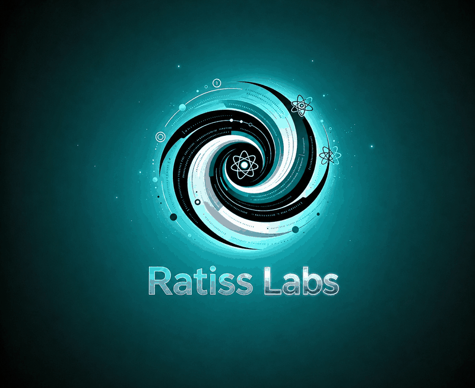
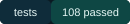
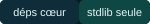
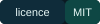
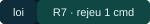
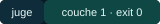
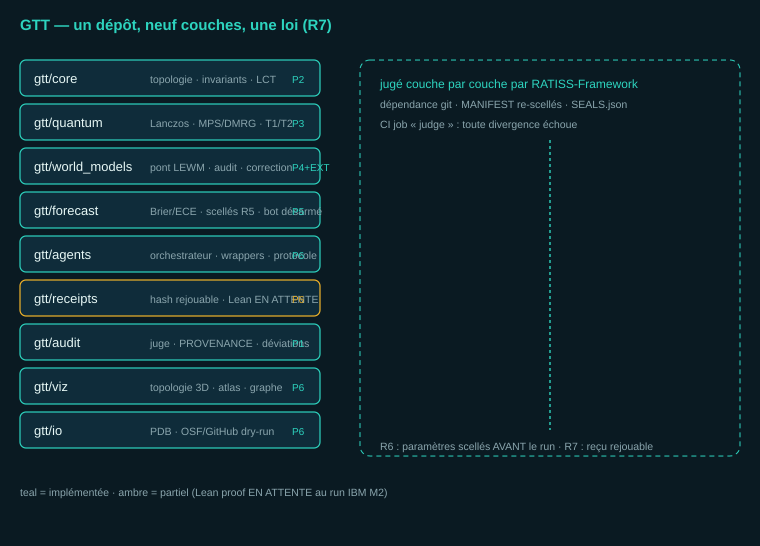
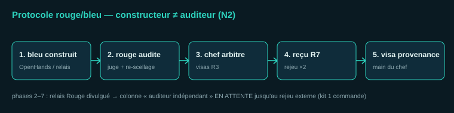
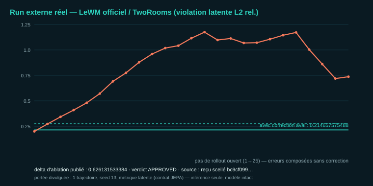
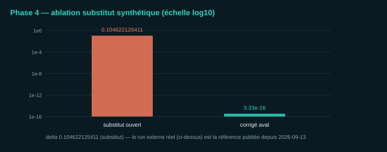

<div align="center">



# RATISS-LABS-GTT
### Geological Topological Tech — dépôt principal de RATISS Labs


    


*Une seule loi : R7 (règle de rejouabilité) — aucune valeur publiée sans
qu'un tiers puisse la rejouer en une commande.*

</div>

---

## 1. Résumé exécutif

Les modèles du monde appris (famille JEPA — Joint-Embedding Predictive
Architecture —, modèles latents) ne respectent pas nativement les
invariants physiques : conservations, symétries, causalité. GTT
(Geological Topological Tech), dépôt principal de RATISS Labs, outille ce
problème : la violation est mesurée, réduite en aval sans modification du
modèle audité, et le delta est publié quel qu'il soit. La méthode combine
un juge mécanique de couche 1 (dépôt RATISS-Framework, dépendance git
scellée analysée en intégration continue), un scellement des paramètres
avant exécution (règle R6), des reçus rejouables (règle R7) et un
protocole rouge/bleu séparant constructeur et auditeur (règle N2).
Résultats au 2026-09-13 : 108 tests hors-ligne passent ; juge mécanique
exit 0 ; 5 vérifications déterministes sur 5 conformes ; premier run
externe réel sur LeWorldModel officiel (LeWM, environnement TwoRooms) :
violation en boucle ouverte 0.840789108872, ramenée à 0.214657575488 par
correction aval, delta d'ablation publié 0.626131533384, verdict APPROVED.
Portée déclarée : une trajectoire, une graine aléatoire, métrique en
espace latent ; auditeur indépendant en attente ; preuves Lean en attente
(run IBM M2).

## 2. Vision

L'objectif de long terme est la correction définitive des violations de
lois physiques dans les modèles du monde appris. Ce terme désigne une
vision de recherche, jamais une affirmation : chaque chiffre publié est
accompagné de son reçu rejouable, et aucune généralisation n'est
revendiquée avant les campagnes de mesure correspondantes.

## 3. Preuves (2026-09-13)

| Mesure | Valeur | Source vérifiable |
|---|---|---|
| Suite de tests | 108 passed (bibliothèque standard seule) | intégration continue `gtt.yml` |
| Juge mécanique couche 1 | exit 0 (sceaux intacts) | job CI `judge` |
| Vérifications déterministes | 5/5 CONFORME (world_models, quantum, forecast, agents, examples) | `scripts/*_check.py` |
| Run externe LeWM/TwoRooms — violation ouverte | 0.840789108872 | `proofs/WM-EXTERNE-LEWM-*.md` |
| Run externe — violation après correction aval | 0.214657575488 | idem |
| Delta d'ablation publié | 0.626131533384 — verdict APPROVED | idem |
| Ablation phase 4 (substitut synthétique) | 0.104622125411 puis ≈3.33e-16 après correction | `proofs/PHASE4-REPLAY*.md` |
| Scellés R6 | 5 manifestes version 0.2.0 figés avant tout code (commit `9990d7e`) | `SEALS.json` |
| Auditeur indépendant | en attente — kit de rejeu en une commande | `docs/AUDIT-INDEPENDANT-KIT.md` |

## 4. Architecture — neuf couches jugées individuellement



| Couche | Rôle | Statut |
|---|---|---|
| `gtt/core` | topologie, thermodynamique, invariants, hypothèse LCT (cohérence topologique locale, statut `HYPOTHESIS`) | implémentée (phase 2) |
| `gtt/quantum` | Lanczos, MPS/DMRG, décohérence T1/T2, connecteur QPU en dry-run | implémentée (phase 3) |
| `gtt/world_models` | pont LEWM, audit de cohérence, correction aval, ablation | implémentée (phase 4) + run externe réel |
| `gtt/forecast` | calibration Brier/ECE, prédictions scellées (R5), journal chaîné, bot Metaculus désarmé | implémentée (phase 5) |
| `gtt/agents` | orchestrateur sans autorité, wrappers rouge/bleu, protocole 1.0 | implémentée (phase 6) |
| `gtt/receipts` | hash rejouable, vérification de reçus ; preuve Lean en attente (règle C5 : aucune preuve fabriquée) | implémentée (phase 6) |
| `gtt/audit` | hooks du juge, PROVENANCE, journal des déviations | implémentée (phase 1) |
| `gtt/viz` | topologie 3D isométrique (SVG), atlas de cohérence, graphe DOT | implémentée (phase 6) |
| `gtt/io` | PDB wwPDB, synchronisations OSF/GitHub en dry-run, jetons par variable d'environnement jamais affichés | implémentée (phase 6) |

Terrains d'épreuve : `examples/TERRAIN-02` (modèle SIR — Susceptible-
Infectieux-Rétabli —, conservation exacte) et `examples/TERRAIN-03`
(chaleur 1D Neumann : régime stable décroissant, régime instable
explosif, graine de von Neumann documentée). Dépôts historiques gelés :
`docs/ORPHELINS.md` — 14 tombstones SHA-256 (fonction de hachage
cryptographique) ; aucun code copié, aucun dépôt supprimé.

## 5. Méthode — protocole rouge/bleu




L'orchestrateur ne détient aucune autorité (registre uniquement).
L'équipe rouge applique le juge et publie des verdicts bruts ; l'équipe
bleue ne répond que par reproductions rejouables. Les phases 2 à 7 ont
été construites par l'équipe Rouge en relais, sur ordre explicite du chef
de labo, avec divulgation complète : la colonne « auditeur indépendant »
de chaque reçu demeure « EN ATTENTE » conformément à la règle N2
(constructeur distinct de l'auditeur). Le rejeu externe s'effectue en une
commande (`docs/AUDIT-INDEPENDANT-KIT.md`) ; le journal public des états
d'audit est tenu dans `docs/AUDIT_TRAIL.md`.

## 6. Run externe réel — LeWM officiel sur TwoRooms



Le modèle audité est LeWorldModel (Maes, Le Lidec, Scieur, LeCun,
Balestriero, 2026), checkpoint TwoRooms public (`quentinll/lewm-tworooms`,
empreinte SHA-256 scellée), dont le code officiel (`lucas-maes/le-wm`) est
importé par dépendance git à commit scellé — aucune copie.
L'environnement est le TwoRoomEnv officiel. L'exécution est en inférence
seule : gradients désactivés, chargement strict du state_dict, modèle non
modifié. La violation mesurée est le contrat d'entraînement JEPA lui-même
(distance L2 relative entre prédiction et embedding ancré). La correction
aval est un ancrage observationnel (rétroaction de type commande
prédictive en horizon glissant), sans fine-tuning.



Certification : `docs/certifications/external/2026-09-13_CERT-GTT-WM-LEWM-EXT-v1.md`
(copie byte-identique, verrouillée par test gardien). Portée déclarée :
une trajectoire, une graine aléatoire, métrique en espace latent — aucune
généralisation revendiquée.

## 7. Reproductibilité (R7)

```bash
git clone https://github.com/brossbernard2-pixel/RATISS-LABS-GTT.git
cd RATISS-LABS-GTT
pip install "ratiss-framework @ git+https://github.com/brossbernard2-pixel/RATISS-Framework.git"
pip install -e .
python -m pytest -q            # 108 passed (dont 6 tests gardiens hors-ligne)
python -m gtt.judge --ci       # exit 0 = sceaux intacts
bash scripts/audit_independant.sh   # rejeu complet + formulaire de verdict
```

Run externe réel (dépendances lourdes optionnelles, environ 5 minutes) :

```bash
pip install torch --index-url https://download.pytorch.org/whl/cpu
pip install "transformers<5" stable-worldmodel einops
python scripts/wm_externe_lewm.py    # reçu horodaté dans proofs/
```

## 8. Carte du dépôt

```
gtt/            les neuf couches (cœur en bibliothèque standard seule)
examples/       TERRAIN-02 (SIR), TERRAIN-03 (chaleur) + expected.json scellés
scripts/        vérifications déterministes, rejeux R7, run externe LeWM, kit d'audit
tests/          108 tests hors-ligne (dont gardien d'intégrité du run externe)
proofs/         reçus R7 horodatés + reçus principaux par phase
docs/           protocole, kit d'audit, journal public, cartographie,
                certifications, ORPHELINS (tombstones), actifs graphiques
gtt/audit/      PROVENANCE : chaque ligne de code a sa source et son commit
```

## 9. Honnêteté structurelle

- Aucune valeur n'est publiée sans reçu rejouable ; aucune publication
  n'intervient sans le visa du chef de labo (règle R3).
- Les certifications des phases 2 à 7 sont des auto-audits divulgués
  (relais Rouge) ; l'auditeur indépendant est en attente, son kit est
  fourni et sa colonne de signature l'attend.
- `lean_proof` est un stub « EN ATTENTE » : aucune preuve Lean fabriquée
  (règle C5) ; complétude prévue au run IBM M2 sur preuves machine réelles.
- Le bot Metaculus est désarmé par construction (hors-ligne, plafond de
  200 questions, soumission réelle interdite dans le dépôt).
- Provenance intégrale : `gtt/audit/PROVENANCE.md`. Anti-copie vérifié par
  scan de blocs de 11 lignes ou plus contre tous les dépôts sources :
  aucun bloc commun.

## 10. Le laboratoire

**Jonathan Evina** — fondateur et chef de labo, RATISS Labs, Yaoundé
(Cameroun). Autorité de vision, d'arbitrage et de visa (règle R3 : les
portes de décision lui appartiennent). ORCID
[0009-0000-4092-5313](https://orcid.org/0009-0000-4092-5313) · GitHub
[jonathansearch](https://github.com/jonathansearch) · contact
professionnel `jonathan.ratisslabs@zohomail.com`.

**Agents** — OpenHands (construction) et équipe Rouge (audit, ainsi que
relais de construction divulgué sur ordre du chef). Le veto de l'auditeur
prime sur le chef de labo : cette règle a permis la détection de la
fabrication présente dans les artefacts internes en septembre 2026.

Dépôt frère : [RATISS-Framework](https://github.com/brossbernard2-pixel/RATISS-Framework)
— méthode et juge de couche 1, qui audite le présent dépôt par dépendance
git scellée en intégration continue.

## 11. Licence et citation

Licence MIT — Copyright (c) 2026 Jonathan Evina, RATISS Labs. Texte
intégral : [`LICENSE`](LICENSE). Citation : [`CITATION.cff`](CITATION.cff).

---

<div align="center">

*La traçabilité des écarts et des échecs renforce la crédibilité des
résultats publiés.*

</div>

---
---

<div align="center">

# English version

*The complete English document follows. No content is mixed between
languages within a section.*

</div>

## 1. Executive summary

Learned world models (JEPA family — Joint-Embedding Predictive
Architecture — and latent models) do not natively respect physical
invariants: conservation laws, symmetries, causality. GTT (Geological
Topological Tech), the flagship repository of RATISS Labs, instruments
this problem: the violation is measured, reduced downstream without
modifying the audited model, and the delta is published whatever its
value. The method combines a layer-1 mechanical judge (RATISS-Framework
repository, sealed git dependency analysed in continuous integration),
parameter sealing before execution (rule R6), replayable receipts (rule
R7), and a red/blue protocol separating builder from auditor (rule N2).
Results as of 2026-09-13: 108 offline tests pass; mechanical judge exit 0;
5 deterministic checks out of 5 conform; first real external run on the
official LeWorldModel (LeWM, TwoRooms environment): open-loop violation
0.840789108872 reduced to 0.214657575488 by downstream correction,
published ablation delta 0.626131533384, verdict APPROVED. Declared scope:
one trajectory, one random seed, latent-space metric; independent auditor
pending; Lean proofs pending (IBM M2 run).

## 2. Vision

The long-term objective is the definitive correction of physical-law
violations in learned world models. This term denotes a research vision,
never a claim: every published number carries its replayable receipt, and
no generalization is claimed before the corresponding measurement
campaigns.

## 3. Evidence (2026-09-13)

| Measure | Value | Verifiable source |
|---|---|---|
| Test suite | 108 passed (standard library only) | CI workflow `gtt.yml` |
| Layer-1 mechanical judge | exit 0 (seals intact) | CI job `judge` |
| Deterministic checks | 5/5 CONFORME (world_models, quantum, forecast, agents, examples) | `scripts/*_check.py` |
| External LeWM/TwoRooms run — open-loop violation | 0.840789108872 | `proofs/WM-EXTERNE-LEWM-*.md` |
| External run — violation after downstream correction | 0.214657575488 | same |
| Published ablation delta | 0.626131533384 — verdict APPROVED | same |
| Phase-4 ablation (synthetic surrogate) | 0.104622125411 then ≈3.33e-16 after correction | `proofs/PHASE4-REPLAY*.md` |
| R6 seals | 5 manifests version 0.2.0 frozen before any code (commit `9990d7e`) | `SEALS.json` |
| Independent auditor | pending — one-command replay kit | `docs/AUDIT-INDEPENDANT-KIT.md` |

## 4. Architecture — nine layers judged individually


| Layer | Role | Status |
|---|---|---|
| `gtt/core` | topology, thermodynamics, invariants, LCT hypothesis (local topological coherence, status `HYPOTHESIS`) | implemented (phase 2) |
| `gtt/quantum` | Lanczos, MPS/DMRG, T1/T2 decoherence, QPU connector in dry-run | implemented (phase 3) |
| `gtt/world_models` | LEWM bridge, coherence audit, downstream correction, ablation | implemented (phase 4) + real external run |
| `gtt/forecast` | Brier/ECE calibration, sealed predictions (R5), chained journal, disarmed Metaculus bot | implemented (phase 5) |
| `gtt/agents` | authority-free orchestrator, red/blue wrappers, protocol 1.0 | implemented (phase 6) |
| `gtt/receipts` | replayable hash, receipt verification; Lean proof pending (rule C5: no fabricated proof) | implemented (phase 6) |
| `gtt/audit` | judge hooks, PROVENANCE, deviation journal | implemented (phase 1) |
| `gtt/viz` | isometric 3D topology (SVG), coherence atlas, DOT graph | implemented (phase 6) |
| `gtt/io` | wwPDB PDB, OSF/GitHub sync in dry-run, tokens via environment variables never echoed | implemented (phase 6) |

Test terrains: `examples/TERRAIN-02` (SIR — Susceptible-Infected-Recovered
— model, exact conservation) and `examples/TERRAIN-03` (1D Neumann heat:
decaying stable regime, exploding unstable regime, documented von Neumann
seed). Frozen historical repositories: `docs/ORPHELINS.md` — 14 SHA-256
tombstones; no code copied, no repository deleted.

## 5. Method — red/blue protocol


The orchestrator holds no authority (registry only). The red team applies
the judge and publishes raw verdicts; the blue team answers only with
replayable reproductions. Phases 2 to 7 were built by the red team in
relay, upon explicit order of the lab chief, with full disclosure: the
"independent auditor" column of every receipt remains "PENDING" under rule
N2 (builder distinct from auditor). External replay is one command
(`docs/AUDIT-INDEPENDANT-KIT.md`); the public audit-state journal is kept
in `docs/AUDIT_TRAIL.md`.

## 6. Real external run — official LeWM on TwoRooms


The audited model is LeWorldModel (Maes, Le Lidec, Scieur, LeCun,
Balestriero, 2026), public TwoRooms checkpoint (`quentinll/lewm-tworooms`,
sealed SHA-256 digest), whose official code (`lucas-maes/le-wm`) is
imported by git dependency at a sealed commit — no copy. The environment
is the official TwoRoomEnv. Execution is inference-only: gradients
disabled, strict state_dict loading, model unmodified. The measured
violation is the JEPA training contract itself (relative L2 distance
between prediction and grounded embedding). The downstream correction is
observational anchoring (receding-horizon predictive-control style
feedback), without fine-tuning.


Certification: `docs/certifications/external/2026-09-13_CERT-GTT-WM-LEWM-EXT-v1.md`
(byte-identical copy, locked by guardian test). Declared scope: one
trajectory, one random seed, latent-space metric — no generalization
claimed.

## 7. Reproducibility (R7)

```bash
git clone https://github.com/brossbernard2-pixel/RATISS-LABS-GTT.git
cd RATISS-LABS-GTT
pip install "ratiss-framework @ git+https://github.com/brossbernard2-pixel/RATISS-Framework.git"
pip install -e .
python -m pytest -q            # 108 passed (including 6 offline guardian tests)
python -m gtt.judge --ci       # exit 0 = seals intact
bash scripts/audit_independant.sh   # full replay + verdict form
```

Real external run (optional heavy dependencies, about 5 minutes):

```bash
pip install torch --index-url https://download.pytorch.org/whl/cpu
pip install "transformers<5" stable-worldmodel einops
python scripts/wm_externe_lewm.py    # timestamped receipt in proofs/
```

## 8. Repository map

```
gtt/            the nine layers (core in standard library only)
examples/       TERRAIN-02 (SIR), TERRAIN-03 (heat) + sealed expected.json
scripts/        deterministic checks, R7 replays, external LeWM run, audit kit
tests/          108 offline tests (including external-run integrity guardian)
proofs/         timestamped R7 receipts + principal receipts per phase
docs/           protocol, audit kit, public journal, cartography,
                certifications, ORPHELINS (tombstones), graphic assets
gtt/audit/      PROVENANCE: every code line has its source and commit
```

## 9. Structural honesty

- No value is published without a replayable receipt; no publication
  occurs without the lab chief's visa (rule R3).
- Phase 2 to 7 certifications are disclosed self-audits (red relay); the
  independent auditor is pending, the kit is provided and the signature
  column awaits.
- `lean_proof` is a "PENDING" stub: no fabricated Lean proof (rule C5);
  completion planned at the IBM M2 run on real machine proofs.
- The Metaculus bot is disarmed by construction (offline, 200-question
  cap, real submission forbidden inside the repository).
- Full provenance: `gtt/audit/PROVENANCE.md`. Anti-copy verified by
  scanning blocks of 11 lines or more against all source repositories:
  no common block.

## 10. The laboratory

**Jonathan Evina** — founder and lab chief, RATISS Labs, Yaoundé
(Cameroon). Authority over vision, arbitration and visas (rule R3:
decision gates belong to him). ORCID
[0009-0000-4092-5313](https://orcid.org/0009-0000-4092-5313) · GitHub
[jonathansearch](https://github.com/jonathansearch) · professional
contact `jonathan.ratisslabs@zohomail.com`.

**Agents** — OpenHands (construction) and red team (audit, plus disclosed
construction relay upon the chief's order). The auditor's veto overrides
the lab chief: this rule enabled the detection of fabrication present in
internal artifacts in September 2026.

Sibling repository: [RATISS-Framework](https://github.com/brossbernard2-pixel/RATISS-Framework)
— layer-1 method and judge, auditing the present repository by sealed git
dependency in continuous integration.

## 11. License and citation

MIT License — Copyright (c) 2026 Jonathan Evina, RATISS Labs. Full text:
[`LICENSE`](LICENSE). Citation: [`CITATION.cff`](CITATION.cff).

---

<div align="center">

*Traceability of deviations and failures strengthens the credibility of
published results.*

</div>
